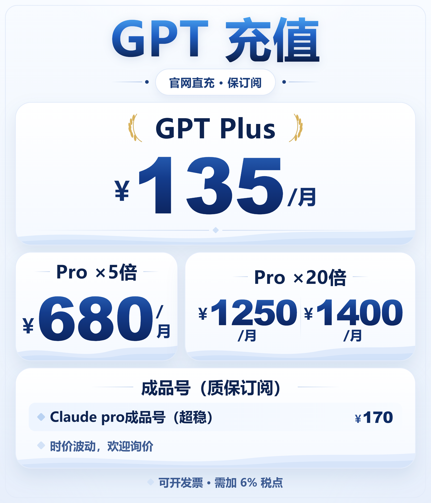

# GPT 充值价目海报

可改价、可一键导出的价目图（发朋友圈 / 小红书 / 私聊报价用）。纯静态 HTML，零依赖，字体只用系统字体，海报里不含任何成本信息。



> 发的时候直接用这张图（2 倍图 2400px 宽，微信/小红书都够清）；改完价跑一次 `node price.mjs` 或双击 `重新生成图片.bat`，会覆盖生成同一张。
> 出图会同时刷新项目根 README 引用的那张 `docs/images/gpt-recharge-price.png`（同一次改价，别让 README 挂旧价）。

| 文件 | 说明 |
|------|------|
| `poster.html` | 海报本体 + 右侧改价面板，双击用 Edge 打开 |
| `price.mjs` | **命令行改价 + 出图**（agent 直接跑这个，见下） |
| `GPT充值价目表.png` | 成品图（生成物，2 倍图） |
| `重新生成图片.bat` | 双击 → 按当前 HTML 重新导出一张成品图 |
| `shot.cjs` | bat 与 price.mjs 实际调用的出图脚本（Playwright + 本机 Edge） |
| `check.cjs` | 自检：改价同步 / 增删条目 / 长文案溢出 / 导出保真度 / 源码无成本字段 |
| `宣传文案.md` | 朋友圈 / 小红书文案（发之前确认数字与海报一致） |

## 改价出图（一条命令，agent 可直接跑）

```bash
node price.mjs                                                       # 看当前价格表
node price.mjs --json                                                # 看当前状态 JSON（agent 用这个读）
node price.mjs --plus 140 --pro5 700 --pro20 1300,1450 --claude 175  # 改价 → 默认自动重出图
node price.mjs --item "claude=175" --no-shot                         # 只改数据 / 只改某一条
node price.mjs --shot                                                # 不改数据，按当前 poster.html 出图
node price.mjs --help                                                # 全部参数
```

- 价格填 `null` 或 `询价` → 海报显示「询价」；填错参数（不认识的 flag、值不合法、Pro ×20 值个数不对）会直接报错退出、不动文件。
- 写入后会**读回校验**（解析回来的必须和写进去的一致，否则自动还原），并同步下面那张价格表；`--dry-run` 只看将要写入的内容。
- 海报里永远只有售价，没有任何成本字段（`check.cjs` 有对应守卫断言）。

## 当前价格（由 price.mjs 自动写入，不含成本）

<!-- PRICES:BEGIN 由 price.mjs 自动写入，别手改这一块 -->
> GPT 充值 — 官网直充 · 保订阅；底部区块：成品号（质保订阅）；底部小字：可开发票 · 需加 6% 税点

| 档位 | 售价 |
|------|------|
| GPT Plus | 135 / 月 |
| Pro ×5倍 | 680 / 月 |
| Pro ×20倍 | 1250 / 月、1400 / 月 |
| Claude pro成品号（超稳） | 170 |
| 时价波动，欢迎询价 | 询价 |
<!-- PRICES:END -->

## 手改也支持

1. **页面面板**：双击 `poster.html`，右侧改价格 / 标题 / 副标题 / 每行条目，海报实时更新；价格清空即显示「询价」；条目可加可删；三/四位数自动缩放字号。点「导出 PNG」直接下载。
2. **直接改数据**：`poster.html` 顶部 `const DEFAULT_STATE = { ... }`（`price: null` = 询价），改完双击 `重新生成图片.bat`。
3. **自检**：`node check.cjs`，末尾应输出「全部通过」。

- Pro ×20 的两个价格目前不带渠道标签（之前「菲区卡充 / IOS充值」两个胶囊按要求去掉了）；要加回来在面板里填「分栏名」即可。
